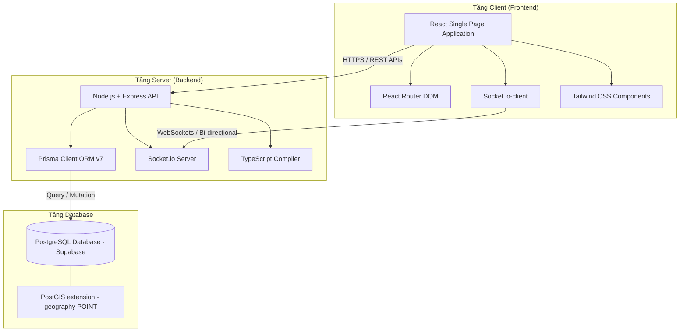

# JV-Taxi - Tài Liệu Khái Quát Dự Án (Project Overview)

**JV-Taxi** là một nền tảng ứng dụng gọi xe thông minh được thiết kế chuyên biệt cho cộng đồng người Nhật Bản đang sinh sống, làm việc hoặc lưu trú tại Hà Nội. Ứng dụng giúp kết nối trực tiếp hành khách người Nhật với các tài xế taxi bản địa có năng lực giao tiếp bằng tiếng Nhật, mang đến trải nghiệm di chuyển an toàn, tiện lợi và không rào cản ngôn ngữ.

---

## 1. Vấn đề & Giải pháp (Business Context)

### Vấn đề thực tế
* **Đối với người Nhật tại Hà Nội:** Rào cản ngôn ngữ lớn khi giao dịch và giao tiếp với tài xế taxi truyền thống hoặc các ứng dụng gọi xe phổ thông, dẫn đến những nhầm lẫn về lộ trình, giá cả hoặc khó khăn khi cần hỗ trợ đặc biệt.
* **Đối với tài xế taxi biết tiếng Nhật:** Có năng lực ngôn ngữ tốt nhưng thiếu một kênh kết nối trực tiếp tập trung để tiếp cận nhóm khách hàng cao cấp, chưa tối ưu hóa được nguồn thu nhập xứng đáng với năng lực giao tiếp tiếng Nhật của bản thân.

### Giải pháp cốt lõi
| Đối tượng | Vấn đề / Trạng thái mong muốn | Giải pháp kỹ thuật & Nghiệp vụ |
| :--- | :--- | :--- |
| **Hành khách** | Tìm kiếm tài xế gần mình nhất trong thời gian ngắn nhất. | Sử dụng định vị GPS thời gian thực để tìm và liệt kê các tài xế trực tuyến trong bán kính 3km. |
| **Hành khách** | Muốn biết thông tin và đánh giá của tài xế trước khi đặt chuyến. | Xem thông tin chi tiết của tài xế: loại xe, trình độ tiếng Nhật, điểm số đánh giá trung bình. |
| **Hành khách** | Lựa chọn linh hoạt giữa việc tự động ghép hoặc chỉ định tài xế yêu thích. | Hỗ trợ hai chế độ: **Ghép tự động (AUTO)** hoặc **Chỉ định tài xế trực tiếp (DESIGNATED)** (có phụ phí chỉ định). |
| **Tài xế** | Muốn thể hiện năng lực chuyên môn để thu hút khách hàng. | Hồ sơ tài xế hiển thị minh bạch chứng chỉ tiếng Nhật, thông tin phương tiện và bằng lái được hệ thống xác minh. |
| **Hành khách & Tài xế** | Giao tiếp, trao đổi thông tin đón trả dễ dàng trên app. | Hệ thống **Chat thời gian thực (Real-time Chat)** và **Gọi điện thoại bảo mật** trực tiếp trong chuyến đi. |
| **Quản trị viên** | Kiểm soát chất lượng dịch vụ và độ tin cậy của tài xế. | Hệ thống phê duyệt giấy tờ (bằng lái, chứng chỉ tiếng Nhật) trước khi tài xế được phép hoạt động trực tuyến. |

---

## 2. Kiến Trúc Hệ Thống (System Architecture)

Hệ thống được phát triển theo mô hình **Client-Server** hiện đại, đảm bảo tính thời gian thực (real-time) cao nhờ tích hợp WebSockets.



### Thành phần công nghệ thực tế:
* **Frontend:** React 18, Vite, TypeScript, Tailwind CSS, Socket.io-client (kết nối thời gian thực), React Router DOM (quản lý luồng trang).
* **Backend:** Node.js, Express, TypeScript, Socket.io (quản lý phòng và phát tín hiệu), Prisma ORM (quản lý kết nối và truy vấn database).
* **Cơ sở dữ liệu:** PostgreSQL lưu trữ trên nền tảng Supabase Cloud. Sử dụng phần mở rộng **PostGIS** để tính toán khoảng cách địa lý chính xác (tọa độ GPS Point) giữa hành khách và tài xế.

---

## 3. Luồng Nghiệp Vụ Đặt Xe Thời Gian Thực (Ride Booking Socket Flow)

Quy trình ghép cuốc và tương tác thời gian thực giữa Hành khách (Passenger) và Tài xế (Driver) được thực hiện thông qua WebSockets như sau:

```mermaid
sequenceDiagram
    autonumber
    actor P as Hành khách (Passenger)
    participant S as Backend Server (Express + Socket.io)
    actor D as Tài xế (Driver)
    database DB as PostgreSQL (Prisma)

    Note over P: Tìm điểm đến & Chọn phương thức đặt xe
    P->>S: POST /api/rides (Thông tin chuyến đi & driverId)
    activate S
    S->>DB: Tạo bản ghi Ride (Trạng thái: PENDING)
    S-->>P: Phản hồi tạo chuyến đi thành công (rideId)
    deactivate S

    Note over S: Gửi yêu cầu qua WebSockets
    S->>D: Phát sự kiện 'new_ride_request' (Thông tin chuyến đi)
    
    alt Tài xế đồng ý (ACCEPTED)
        D->>S: PUT /api/rides/:id/status (status: ACCEPTED)
        activate S
        S->>DB: Cập nhật Ride (status: ACCEPTED, gán driverId)
        S->>P: Phát sự kiện 'ride_status_updated' (Trạng thái: ACCEPTED + Thông tin tài xế)
        S-->>D: Phản hồi thành công
        deactivate S
        Note over P, D: Cả hai chuyển sang màn hình "Trong chuyến đi"<br/>Kích hoạt kênh Chat thời gian thực
        
        loop Trò chuyện trong chuyến đi (Chat Flow)
            P->>S: Gửi tin nhắn qua Socket ('send_message')
            S->>DB: Lưu tin nhắn vào database
            S->>D: Chuyển tiếp tin nhắn qua Socket ('receive_message')
        end
        
    else Tài xế từ chối (REJECTED)
        D->>S: PUT /api/rides/:id/status (status: REJECTED)
        activate S
        S->>DB: Cập nhật Ride (status: REJECTED)
        S->>P: Phát sự kiện 'ride_status_updated' (Trạng thái: REJECTED)
        S-->>D: Phản hồi thành công
        deactivate S
        Note over P: Hệ thống hiển thị thông báo ghép chuyến thất bại<br/>Hành khách chọn tài xế khác hoặc dùng ghép tự động
    end
```

---

## 4. Vai Trò Người Dùng (User Roles & Permissions)

Hệ thống phân chia quyền truy cập và chức năng rất rõ ràng dựa trên Model `Profile` (trường `role`):

1. **Khách (Guest / Chưa đăng nhập):**
   * Được quyền xem trang giới thiệu, tìm kiếm địa điểm mẫu.
   * Thực hiện Đăng nhập hoặc chọn vai trò Đăng ký (Hành khách hoặc Tài xế).
2. **Hành khách (Customer):**
   * Đã đăng nhập vào hệ thống.
   * Có quyền tìm kiếm tài xế xung quanh dựa trên vị trí GPS.
   * Tạo yêu cầu chuyến đi (AUTO / DESIGNATED).
   * Theo dõi trạng thái chuyến đi, chat real-time với tài xế, viết đánh giá (Review) sau khi hoàn thành chuyến đi.
   * Quản lý thông tin cá nhân và phương thức thanh toán.
3. **Tài xế (Driver):**
   * Tài khoản được đăng ký riêng với các thông tin giấy phép lái xe, chứng chỉ tiếng Nhật và thông tin phương tiện.
   * Bật/Tắt trạng thái hoạt động trực tuyến (Online/Offline) trên Dashboard.
   * Nhận thông tin yêu cầu chuyến đi thời gian thực, thực hiện Chấp nhận hoặc Từ chối chuyến.
   * Xem doanh thu cá nhân, quản lý thông tin phương tiện và lịch sử các chuyến đi đã chở khách.
4. **Quản trị viên (Admin):**
   * Kiểm soát toàn bộ hệ thống, quản lý tài khoản người dùng, phê duyệt hồ sơ đăng ký mới của tài xế.

> [!NOTE]
> **Hiện trạng triển khai vai trò Admin:** 
> Vai trò Admin hiện tại đã được thiết kế sẵn trong Database Schema (`Role.ADMIN`), tuy nhiên giao diện quản trị (Admin Dashboard) ở Frontend và các API phê duyệt ở Backend hiện đang nằm trong lộ trình phát triển tiếp theo (Roadmap), chưa được xây dựng ở phiên bản hiện tại.

---

## 5. Bản Đồ Màn Hình & Route Thực Tế (Frontend Screens & Navigation)

Dưới đây là sơ đồ chi tiết các màn hình thực tế được định nghĩa và triển khai trong mã nguồn Frontend (`frontend/src/routes/index.tsx`):

### 5.1. Luồng cho Khách (Guest Flow - Chưa đăng nhập)
| Route URL | Tên Màn Hình / Component | Chức Năng Chính |
| :--- | :--- | :--- |
| `/` | `GuestHome` | Trang chủ giới thiệu dịch vụ, tìm kiếm demo. |
| `/guest/search-location` | `GuestSearchLocation` | Trải nghiệm chọn điểm đến dùng thử cho khách vãng lai. |
| `/login` | `SignIn` | Màn hình đăng nhập tài khoản (Hành khách & Tài xế). |
| `/signup` | `SignUpSelection` | Lựa chọn vai trò đăng ký tài khoản mới. |
| `/signup/passenger` | `PassengerSignUp` | Biểu mẫu đăng ký tài khoản dành riêng cho Hành khách. |
| `/signup/driver` | `DriverSignUp` | Biểu mẫu đăng ký tài khoản cho Tài xế (yêu cầu điền bằng lái, loại xe). |

### 5.2. Luồng cho Hành Khách (Passenger Flow - Đã đăng nhập)
| Route URL | Tên Màn Hình / Component | Chức Năng Chính |
| :--- | :--- | :--- |
| `/passenger` | `PassengerHome` | Trang chủ hành khách: Bản đồ GPS, danh sách tìm kiếm điểm đến. |
| `/passenger/search-location` | `SearchLocation` | Giao diện tìm kiếm, chọn điểm đón và điểm trả khách trên bản đồ. |
| `/passenger/booking-options` | `BookingOptions` | Chọn phương thức đặt xe: Ghép tự động hoặc Chỉ định tài xế trực tiếp. |
| `/passenger/select-driver` | `SelectDriver` | Hiển thị danh sách các tài xế trực tuyến trong bán kính 3km kèm giá cước ước tính. |
| `/passenger/driver-detail` | `DriverDetail` | Xem chi tiết thông tin một tài xế (Ảnh, Xe, Đánh giá, Trình độ tiếng Nhật). |
| `/passenger/waiting-driver` | `WaitingDriver` | Màn hình chờ tài xế xác nhận yêu cầu chuyến đi (đếm ngược thời gian xác nhận). |
| `/passenger/ride-in-progress` | `RideInProgress` | Theo dõi bản đồ di chuyển thực tế khi đang ở trong chuyến đi. |
| `/passenger/chat` | `ChatScreen` | Kênh chat thời gian thực gửi tin nhắn hỗ trợ tài xế trong chuyến đi. |
| `/passenger/profile` | `Profile` | Quản lý thông tin hồ sơ hành khách, đăng xuất tài khoản. |

### 5.3. Luồng cho Tài Xế (Driver Flow - Đã đăng nhập)
| Route URL | Tên Màn Hình / Component | Chức Năng Chính |
| :--- | :--- | :--- |
| `/driver` | `DriverDashboard` | Màn hình trung tâm: Bật/tắt trạng thái trực tuyến, hiển thị popup yêu cầu chuyến đi mới. |
| `/driver/home` | `DriverHome` | Màn hình quản lý trạng thái và hồ sơ nhanh của tài xế. |
| `/driver/ride-in-progress` | `DriverRideInProgress` | Giao diện di chuyển trong chuyến đi, hiển thị thông tin đón khách và nút hoàn thành. |
| `/driver/chat` | `DriverChatScreen` | Giao diện chat thời gian thực với hành khách của cuốc xe hiện tại. |

---

## 6. Lộ Trình Phát Triển Hệ Thống (Future Roadmap)

Để nâng cấp JV-Taxi thành một sản phẩm thương mại toàn diện, các tính năng sau sẽ được ưu tiên phát triển tiếp theo:
1. **Phân hệ Admin hoàn chỉnh:** Xây dựng màn hình phê duyệt tự động giấy tờ tài xế bằng công nghệ OCR, quản lý và chặn các tài khoản vi phạm chính sách cộng đồng.
2. **Tích hợp cổng thanh toán trực tuyến:** Hỗ trợ thanh toán tự động qua VNPay, Momo, hoặc thẻ tín dụng quốc tế (Visa/Mastercard) với hóa đơn điện tử gửi tự động qua Email.
3. **Thuật toán tự động ghép chuyến (Auto-matching logic):** Phát triển cơ chế tự động tìm và gán chuyến đi cho tài xế tối ưu nhất xung quanh khách hàng dựa trên khoảng cách di chuyển thực tế bằng đường bộ (thay vì đường chim bay).
4. **Hệ thống đa ngôn ngữ (i18n):** Hỗ trợ chuyển đổi nhanh giao diện sang tiếng Nhật hoàn toàn cho Hành khách và tiếng Việt hoàn toàn cho Tài xế để tối ưu trải nghiệm sử dụng.
